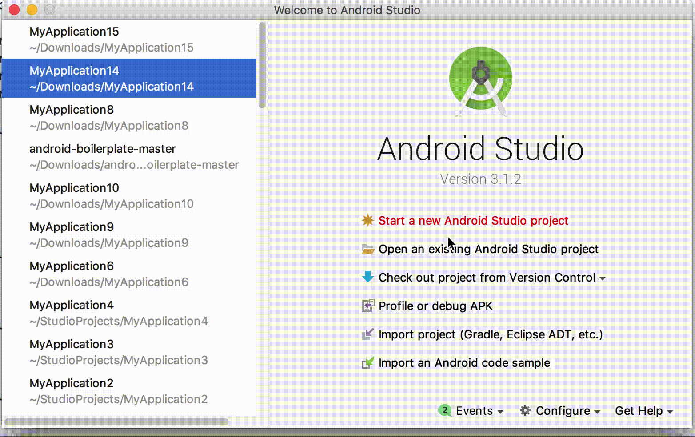

# Android-Studio-MVVM-DataBinding-Dagger-Template-Google-Architecture (Java & Kotlin)

This is an Android Studio template for MVVM; the template is inspired by [google samples/ android architecture](https://github.com/googlesamples/android-architecture/tree/todo-mvvm-databinding/)

`Important`: The main goal of this template is to speed up the development process using android MVVM template. This is just a template and basic code, so feel free to make changes according to your needs. It also shows how to create a set of files using template files in Android Studio. This template was successfully tested with Android 3.1.1.

## Demo


## Code Quality

This project integrates a combination of unit tests, functional test and code analysis tools. 

### Tests

To run **unit** tests on your machine:

``` 
./gradlew test
``` 

To run **functional** tests on connected devices:

``` 
./gradlew connectedAndroidTest
``` 

Note: For Android Studio to use syntax highlighting for Automated tests and Unit tests you **must** switch the Build Variant to the desired mode.

### Code Analysis tools 

The following code analysis tools are set up on this project:

* [PMD](https://pmd.github.io/): It finds common programming flaws like unused variables, empty catch blocks, unnecessary object creation, and so forth. See [this project's PMD ruleset](config/quality/pmd/pmd-ruleset.xml).

``` 
./gradlew pmd
```

* [Findbugs](http://findbugs.sourceforge.net/): This tool uses static analysis to find bugs in Java code. Unlike PMD, it uses compiled Java bytecode instead of source code.

```
./gradlew findbugs
```

* [Checkstyle](http://checkstyle.sourceforge.net/): It ensures that the code style follows [our Android code guidelines](https://github.com/ribot/android-guidelines/blob/master/project_and_code_guidelines.md#2-code-guidelines). See our [checkstyle config file](config/quality/checkstyle/checkstyle-config.xml).

```
./gradlew checkstyle
```

### The check task

To ensure that your code is valid and stable use check: 

```
./gradlew check
```

This will run all the code analysis tools and unit tests in the following order:


 

## Installation

#### For Mac:

- If you have a standard Android Studio installation:

Just run the install script at the root of this repository:

```
./install.sh
```

- Manual installation:

Just copy directory `MVVMTemplate/*` to `$ANDROID_STUDIO_FOLDER$/Contents/plugins/android/lib/templates/activities/`

#### For Windows:

Just copy directory `MVVMTemplate/*` to `$ANDROID_STUDIO_FOLDER$\plugins\android\lib\templates\activities\`

## How to use

#### 1. Create Base classes

The main idea of the base classes is to have common methods that share across the Activities, Navigator, ViewModel and Module written down in one place.

Code Basic
- BaseActivity
```
abstract class BaseActivity<T : ViewDataBinding, V : BaseViewModel<*>> : AppCompatActivity(), BaseFragment.Callback {

    var viewDataBinding: T? = null
        private set
    private var mViewModel: V? = null

    ...
    @get:LayoutRes
    abstract val layoutId: Int
    
	...    
    private fun performDataBinding() {
        viewDataBinding = DataBindingUtil.setContentView(this, layoutId)
        this.mViewModel = if (mViewModel == null) viewModel else mViewModel
        viewDataBinding!!.setVariable(bindingVariable, mViewModel)
        viewDataBinding!!.executePendingBindings()
    }

    fun performDependencyInjection() {
        AndroidInjection.inject(this)
    }
}
```

- BaseFragment
```
public abstract V getViewModel();
abstract class BaseFragment<T : ViewDataBinding, V : BaseViewModel<*>> : Fragment() {

    var baseActivity: BaseActivity<*, *>? = null
        private set
    var viewDataBinding: T? = null
        private set
    private var mViewModel: V? = null
    private var mRootView: View? = null
    
    @get:LayoutRes
    abstract val layoutId: Int
    
    private fun performDependencyInjection() {
        AndroidSupportInjection.inject(this)
    }

    interface Callback {

        fun onFragmentAttached()

        fun onFragmentDetached(tag: String)
    }
}

```

- BaseViewModel
```
abstract class BaseViewModel<N>(val dataManager: DataManager,
                                val schedulerProvider: SchedulerProvider) : ViewModel() {
    val isLoading = ObservableBoolean(false)
    var navigator: N? = null
    val compositeDisposable: CompositeDisposable

    init {
        this.compositeDisposable = CompositeDisposable()
    }

    fun setIsLoading(isLoading: Boolean) {
        this.isLoading.set(isLoading)
    }

    override fun onCleared() {
        compositeDisposable.dispose()
        super.onCleared()
    }
}


```

- BaseViewHolder for ```RecycleView.Adapter```
```
abstract class BaseViewHolder(itemView: View) : RecyclerView.ViewHolder(itemView) {
    abstract fun onBind(position: Int)
}


```
#### 2. Create Activity MVVM template


Support
-------

If you've found an error in this sample, please file an issue to
https://github.com
Patches are encouraged, and may be submitted by forking this project and
submitting a pull request through GitHub.

License
-------

[](https://opensource.org/licenses/Apache-2.0)

Copyright 2017 Bach

Licensed under the Apache License, Version 2.0 (the "License");
you may not use this file except in compliance with the License.
You may obtain a copy of the License at

http://www.apache.org/licenses/LICENSE-2.0

Unless required by applicable law or agreed to in writing, software
distributed under the License is distributed on an "AS IS" BASIS,
WITHOUT WARRANTIES OR CONDITIONS OF ANY KIND, either express or implied.
See the License for the specific language governing permissions and
limitations under the License.

